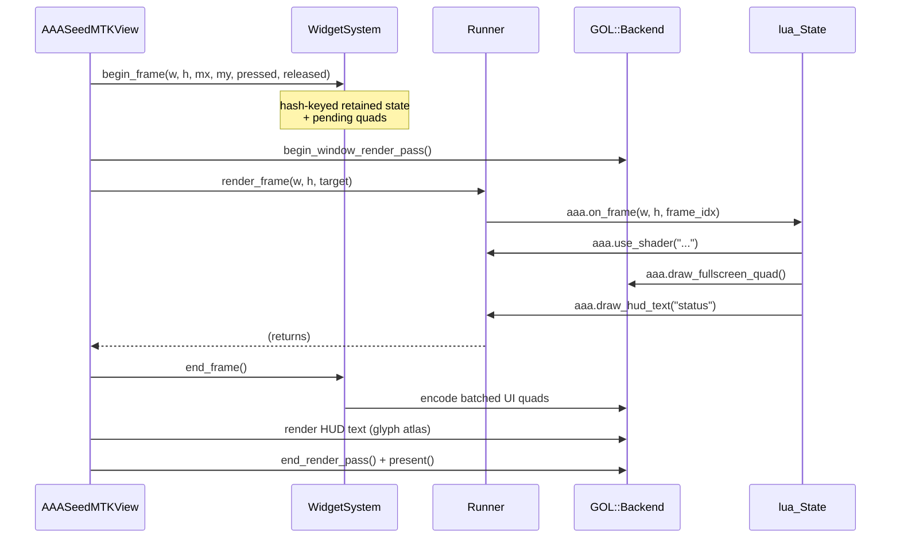

# Architecture

AAASeed for Mac is a Mac-native VJ / generative-art engine. The
architecture is designed around a small `.app` host that owns a Metal
backend and routes user input + Lua-script-driven rendering onto a
catalog of 169 `.metal` shaders.

This page is the developer's mental map. For history + decisions see the
[memory doctrine index](memory-doctrine.md).

---

## High-level diagram

```mermaid
flowchart LR
    subgraph App["AAASeed.app"]
        Delegate[AAASeedAppDelegate]
        MTKView[AAASeedMTKView]
        InputView[AAASeedInputView<br/><i>NSTextInputClient</i>]
        Delegate --> MTKView
        MTKView -.subclass.-> InputView
    end

    subgraph Render["Render side"]
        Backend[GOL::Backend<br/>MetalBackend]
        Shaders[(169 .metal<br/>shaders)]
        Backend --> Shaders
    end

    subgraph Authoring["Authoring side"]
        Runner[aaa::meu::Runner]
        Widgets[aaa::ui::widgets::<br/>WidgetSystem]
        FileWatcher[aaa::meu::<br/>FileWatcher]
        Lua[(lua_State)]
        Runner --> Lua
        Runner <--> Widgets
        Runner --> FileWatcher
    end

    MTKView --> Backend
    MTKView --> Runner
    MTKView --> Widgets
    InputView --> Widgets

    Runner -.aaa.* bindings.-> Backend
    Widgets -.batched draws.-> Backend
```

---

## Subsystem boundaries

The Mac port deliberately limits the surface of vendor-engine code it
absorbs. Most user-visible functionality is in **Mac-native sub-libs**
under `src/` that compile without the blocked `aaa_mem` / `c_cpu`
cascade.

| Layer                       | Lives in                                                | Doctrine                                                                       |
| --------------------------- | ------------------------------------------------------- | ------------------------------------------------------------------------------ |
| App host (Cocoa / MTKView)  | `src/ui/macos/`                                         | Mac-only ; Objective-C++ ; subclasses `MTKView`                                |
| Metal rendering backend     | `src/aaa/` + `src/macos/`                               | `GOL::Backend` -- present-per-pass discipline                                  |
| Shader catalog              | `src/shaders/msl/` (169 `.metal` files)                 | [Path A revival pattern](memory-doctrine.md#path-a-revival-pattern)            |
| MEU runner (Lua VM + draws) | `src/meu/aaa_meu_runner_mac.{h,mm}`                     | [Hermetic Mac sub-lib](memory-doctrine.md#hermetic-mac-sub-libs)               |
| File watcher (hot reload)   | `src/meu/aaa_file_watcher_mac.{h,mm}`                   | FSEvents ; GCD dispatch                                                        |
| Widget UI system            | `src/ui/widgets/aaa_widgets_mac.{h,mm}`                 | Immediate-mode + retained state ; hermetic                                     |
| Input event bridges         | `src/ui/macos/aaa_event_bridge*.{h,mm}`                 | [Bridge API standardization](memory-doctrine.md#bridge-api-standardization)    |
| Lua bindings                | inline in `aaa_meu_runner_mac.mm`                       | Raw `lua_pushcfunction` (NO `AAALUACALL` macros)                               |
| Vendor engine (limited)     | `aaaseed-windows/` submodule subset                     | Touched only via shadow shims                                                  |

The vendor engine's **layer subsystem** (`Src/infrastructure/layer/`,
~7 files / ~6.7 K LOC) is **NOT** in the Mac build. Per
[`project_layer_supersession.md`](../../memory/project_layer_supersession.md)
and c142-C the layer subsystem is formally **superseded** by :

- **MEU Runner** (per-frame Lua entry point + shader dispatch).
- **Path A catalog** (the 169 `.metal` shaders).
- **MetalBackend** (`GOL::Backend` present-per-pass + multi-pass).

These three together cover the rendering surface the layer subsystem
would have provided, without dragging in the blocked `aaa_mem` /
`c_cpu` dependency cone. The supersession is reopened **only** with
vendor authorization + a user-surfaced asset-parity need + the
matching Win-side Task #152 work-tree (see
[Windows backend doc](windows-backend.md)).

---

## Render-loop sequence

The render loop is a single-threaded pump rooted in MetalKit's
`drawInMTKView:` callback. The view orchestrates the three side
subsystems (Backend, WidgetSystem, Runner) in a strict order :



Per [`feedback_metal_present_per_pass.md`](memory-doctrine.md#metal-present-per-pass)
**every** `end_render_pass()` is paired with a matching
`present()`. Skipping a present causes silent corruption + perf-test
command-queue saturation.

---

## Threading model

AAASeed for Mac runs single-threaded for rendering :

- **Main thread** : `drawInMTKView:` -> WidgetSystem + Runner + Backend.
- **GCD background queue** : `aaa::meu::FileWatcher` runs FSEvents
  callbacks on a `dispatch_queue_create("aaa.meu.filewatcher", ...)`.
  When a watched `.lua` changes, the watcher dispatches the reload
  callback to the main queue via `dispatch_async(dispatch_get_main_queue())`,
  so `Runner::reload()` always executes on the render thread.
- **Cocoa main run loop** : NSEvent dispatch (mouse / keyboard /
  drag-drop). Forwarded to per-view bridges per
  [Bridge API standardization](memory-doctrine.md#bridge-api-standardization).
- **`distnoted`** : two `CFNotificationCenter` channels for parallel
  ctest distributed notifications per
  [Distnoted dual-center](memory-doctrine.md#distnoted-dual-center).

A single `MTLCommandQueue` (owned by `GOL::Backend`) services every
frame. There is no separate compute queue ; multi-pass shaders run
sequentially in command buffers.

---

## Lua VM lifecycle

Each `aaa::meu::Runner` owns exactly one `lua_State`. The lifecycle :

1. `Runner` constructor : creates **no** Lua VM.
2. `Runner::load_script(path)` : `luaL_newstate()` + register `aaa.*`
   binding table + `luaL_dofile(path)`. The script's top-level body
   runs once.
3. Each `Runner::render_frame()` : look up `aaa.on_frame` global, push
   `(width, height, frame_idx)`, `lua_pcall`. Errors are logged via
   `aaa.log_error` but do not crash the app -- the next frame still
   calls `aaa.on_frame`.
4. `Runner::reload()` : the **lua_State is NOT torn down**. The script
   file is re-read + re-run as a new chunk. Globals from the previous
   run persist (Lua's normal idempotent re-registration), but any
   table the script rebuilds in its top-level body gets the fresh
   value.
5. `Runner::unload()` or destructor : `lua_close(L)` + clear cached
   shader IDs.

The Lua bindings use raw `lua_pushcfunction` per c124-A and the c124
hermetic doctrine -- **NOT** the engine's `AAALUACALL` macros. This
keeps the runner buildable without `aaalua`'s reflection chain.

---

## Cross-references

- [Building from source](building.md)
- [Running tests](testing.md)
- [Ship script](ship-script.md)
- [Memory doctrine index](memory-doctrine.md)
- [Path A catalog](path-a-catalog.md)
- [MEU runner](meu-runner.md)
- [Widget system](widget-system.md)
- [NSTextInputClient + IME](nstextinputclient.md)
- [Windows backend](windows-backend.md)
- [Layer supersession decision](../../memory/project_layer_supersession.md)
- [v1 ship gate inventory](../../memory/project_v1_ship_gate.md)
- [v4 milestone closure](../../memory/project_v4_milestone.md)
