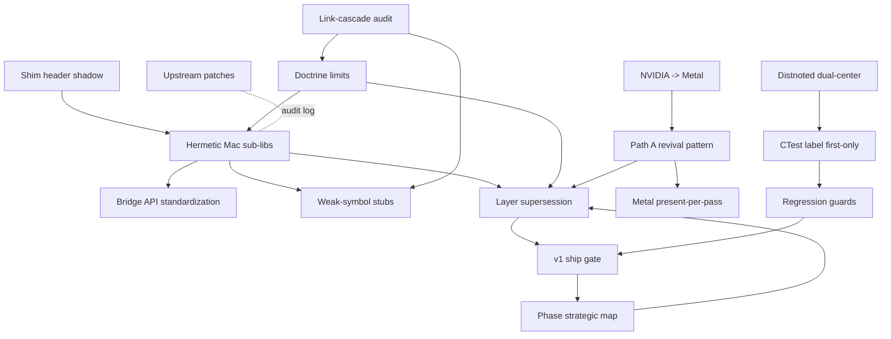

# Memory doctrine index

Throughout the Mac port we extracted recurring engineering patterns
into short, focused **doctrine memos**. Each memo captures one specific
gotcha + the canonical workaround, indexed for fast retrieval in
future sessions.

This page is the developer-facing index. The source-of-truth files
live in `memory/feedback_*.md` and `memory/project_*.md` and are
linked from each entry below.

---

## How to read this index

Each doctrine has :

- **Path** -- relative link to the source memo.
- **Description** -- one paragraph in plain English.
- **When to apply** -- the trigger conditions where the doctrine
  matters.
- **Companion links** -- other doctrines this one composes with.

The doctrines form a small graph. The
[companion-link graph](#companion-link-graph) at the bottom shows the
clusters.

---

## Doctrines (alphabetical within section)

### Build + linking

#### Upstream patches

- **Path** : [`memory/feedback_upstream_patches.md`](../../memory/feedback_upstream_patches.md)
- **Description** : Pre-approves one-line, behavior-preserving cleanups
  in the `aaaseed-windows/` submodule during the Mac port. Avoids the
  ceremony of a fresh PR for trivia like missing newlines or `#endif`
  comments, while keeping a log of every touch in
  `memory/handover_session.md`.
- **When to apply** : you're about to make a vendor edit smaller than
  three lines that does not change behavior on Windows.

#### Hermetic Mac sub-libs

- **Path** : [`memory/feedback_hermetic_mac_sublibs.md`](../../memory/feedback_hermetic_mac_sublibs.md)
- **Description** : When porting tiny Win32-only files, build a
  hermetic Mac sub-lib in `src/` using `std::` primitives, **NOT**
  `o_str` / `aaa_mem.h`. This sidesteps the blocked
  `aaa_mem` / `c_cpu` dependency cascade and lets the Mac binary link
  long before the full engine is portable.
- **When to apply** : any new Mac-side `.cpp` / `.mm` that would
  otherwise pull in `aaa_mem` or `c_cpu`.

#### Shim header shadow

- **Path** : [`memory/feedback_shim_header_shadow.md`](../../memory/feedback_shim_header_shadow.md)
- **Description** : When a vendor `.cpp`'s includes leak Win32 types
  or MSVC pragmas, **shadow** the offending header in
  `tests/unit/<target>_shim/` with a shim that appears BEFORE the
  engine path on `-I`. Keeps the vendor file untouched + portable.
- **When to apply** : test target fails to compile because a vendor
  header references `HRESULT` / `__forceinline` / `#pragma comment(lib...)`.

#### Link-cascade audit

- **Path** : [`memory/feedback_link_cascade_audit.md`](../../memory/feedback_link_cascade_audit.md)
- **Description** : When `.cpp` files compile-green but the link step
  is multi-session, build an `EXCLUDE_FROM_ALL` audit target listing
  them all + stubs. Group unresolved symbols by subsystem prefix; look
  for "vtable collapses when base lands". Surfaces the dependency
  topology before you spend a day fighting individual symbols.
- **When to apply** : ld errors number in the dozens and a hand
  resolution feels like whack-a-mole.

#### Weak-symbol stubs

- **Path** : [`memory/feedback_weak_symbol_stubs.md`](../../memory/feedback_weak_symbol_stubs.md)
- **Description** : When stubbing symbols a future port **will**
  provide, use `__attribute__((weak))`. Strong definitions win at link
  time, so stubs vanish automatically when the real port lands. For
  libc primitives (`memmove` / `memcpy` / `memset`) forward directly to
  the Mac libc.
- **When to apply** : you need a temporary stub but want zero
  follow-up cleanup when the real implementation arrives.

#### Doctrine limits

- **Path** : [`memory/feedback_doctrine_limits.md`](../../memory/feedback_doctrine_limits.md)
- **Description** : The faked-class compile-only technique works for
  **linear transitive cones** (aaalua), but FAILS on fan-out adapter
  layers (the layer subsystem). After 2 iterations where shim count
  grows faster than error count shrinks, STOP and pivot to vendor
  patch or skip-entry-point.
- **When to apply** : you've been writing shims for an hour and the
  error count is going UP, not down.

### Platform translation

#### NVIDIA / CUDA -> Apple Metal

- **Path** : [`memory/feedback_nvidia_to_metal.md`](../../memory/feedback_nvidia_to_metal.md)
- **Description** : Any NVIDIA / CUDA code in upstream substitutes the
  matching Apple framework on Mac ; never stub when a real native port
  exists. The vendor's GPU rendering vocabulary maps cleanly to
  Metal + MetalPerformanceShaders + MetalFX.
- **When to apply** : you find a CUDA kernel / NVAPI call / SM-arch
  intrinsic in the upstream pipeline.

#### Path A revival pattern

- **Path** : [`memory/feedback_path_a_revival_pattern.md`](../../memory/feedback_path_a_revival_pattern.md)
- **Description** : When porting a stubbed Path A shader to the real
  algorithm, create a NEW file `<name>_<algo>.metal`. Original stub is
  PRESERVED ; both coexist in the catalog ; regression baseline intact ;
  new regression test for the revival ; algorithm citation inline at
  the top of the new file.
- **When to apply** : reviving any of the 169 Path A stubs to a real
  algorithm. See [Path A catalog](path-a-catalog.md) for the 11
  revivals already shipped.

#### Metal present-per-pass

- **Path** : [`memory/feedback_metal_present_per_pass.md`](../../memory/feedback_metal_present_per_pass.md)
- **Description** : Multi-pass Metal pipelines MUST call
  `backend.present()` after EVERY `end_render_pass()`. Skipping a
  present causes silent visual corruption (intermediate reads = cleared
  bytes) + iterated perf-test hangs (command queue saturation). Cost
  twice : c140-A correctness + c140-B 8-hour hang.
- **When to apply** : any multi-pass shader pipeline (bloom, motion
  blur, deferred lighting).

### Wiring + bridges

#### Bridge API standardization

- **Path** : [`memory/feedback_bridge_api_standardization.md`](../../memory/feedback_bridge_api_standardization.md)
- **Description** : Mac event / IPC bridges expose BOTH
  `handle_ns_event(NSEvent*)` (consumer entry) AND
  `push(EngineEvent)` (synthetic). Land both in the initial commit ;
  mismatch costs ~30 min at wiring time.
- **When to apply** : creating any new event bridge
  (`aaa_event_bridge*`, `aaa_event_bridge_gesture*`).

### Test infrastructure

#### CTest label first-only

- **Path** : [`memory/feedback_ctest_label_first_only.md`](../../memory/feedback_ctest_label_first_only.md)
- **Description** : `gtest_discover_tests PROPERTIES LABELS` honors
  ONLY the first label on this toolchain. Put the primary filter key
  (`perf`, `regression`, etc.) FIRST. Subsequent labels are accepted
  by CMake but silently ignored by `ctest -L`.
- **When to apply** : adding a test that needs multiple labels and you
  want `ctest -L X` to find it.

#### Distnoted dual-center

- **Path** : [`memory/feedback_distnoted_dual_center.md`](../../memory/feedback_distnoted_dual_center.md)
- **Description** : Mac `distnoted` drops distributed notifications
  between parallel ctest workers. Post + observe on BOTH
  `CFNotificationCenterGetLocalCenter()` (in-process sync) AND
  `GetDistributedCenter()` (cross-process best-effort).
- **When to apply** : any test that uses
  `CFNotificationCenterPostNotification` and runs under `ctest -j`.

#### Regression guard tests

- **Path** : [`memory/feedback_regression_guard_tests.md`](../../memory/feedback_regression_guard_tests.md)
- **Description** : When a beachhead DEFERS a sub-feature (signing,
  sandbox, network) for governance reasons, add a regression-guard
  test asserting the deferred symbol does NOT appear in source.
  Prevents silent creep.
- **When to apply** : you're explicitly NOT implementing X for v1 but
  X is tempting to slip in later.

### Project decisions

#### Project phase strategic map

- **Path** : [`memory/project_phase_strategic_map.md`](../../memory/project_phase_strategic_map.md)
- **Description** : Phase dependency graph for the Mac port. Phase 3
  (graphics backend exit) gates Phases 6 - 7 ; Phases 4 - 5 are
  prerequisite supply chains. `memcpy.cpp` was the highest-leverage
  single port remaining at the time of writing.
- **When to apply** : planning a new feature ; want to know what gates
  what.

#### Project v1 ship gate

- **Path** : [`memory/project_v1_ship_gate.md`](../../memory/project_v1_ship_gate.md)
- **Description** : c142-C inventory-confirmed v1 gates : engine event
  adapter + sample MEU + `.deproj` round-trip. Layer / BDD / GOL NOT
  v1 blockers -- Path A + MetalBackend cover the rendering surface.
  Code-sign + notarize need external creds. Includes the **project
  closure** section recording v4 as the final version milestone.
- **When to apply** : tempted to add a new v1 blocker ? Check the
  inventory first.

#### Layer subsystem supersession

- **Path** : [`memory/project_layer_supersession.md`](../../memory/project_layer_supersession.md)
- **Description** : Task #31 (Windows layer subsystem port, ~7 files /
  ~6.7 K LOC core) formally SUPERSEDED by c142-B MEU runner + Path A
  catalog + MetalBackend. Includes the mapping table from Windows
  `Src/infrastructure/layer/` files to Mac equivalents. Reopens ONLY
  with vendor authorization + user-surfaced asset-parity need +
  Win-side Task #152.
- **When to apply** : tempted to start porting the layer subsystem ?
  Read this first.

---

## Companion-link graph

Clusters :

- **Build + linking** : Hermetic + Shim + LinkAudit + Weak + Limits
  form the "how do we link the Mac binary" cone.
- **Platform translation** : NVIDIA-to-Metal + Path A + Present-per-pass
  form the rendering cone.
- **Wiring** : Bridge standardization sits between Hermetic and the
  Mac event surface.
- **Tests** : Label + Distnoted + Regression form the CI hygiene cone.
- **Project decisions** : Phase + v1 gate + Layer supersession form
  the scope-control cone.

---

## Cross-references

- [Architecture](architecture.md) -- subsystem boundaries reference
  these doctrines inline.
- [Building from source](building.md) -- common gotchas reference
  Label + Distnoted.
- [Path A catalog](path-a-catalog.md) -- documents every revival per
  Path A pattern.
- [Testing](testing.md) -- references Label + Distnoted + Regression
  guards.
