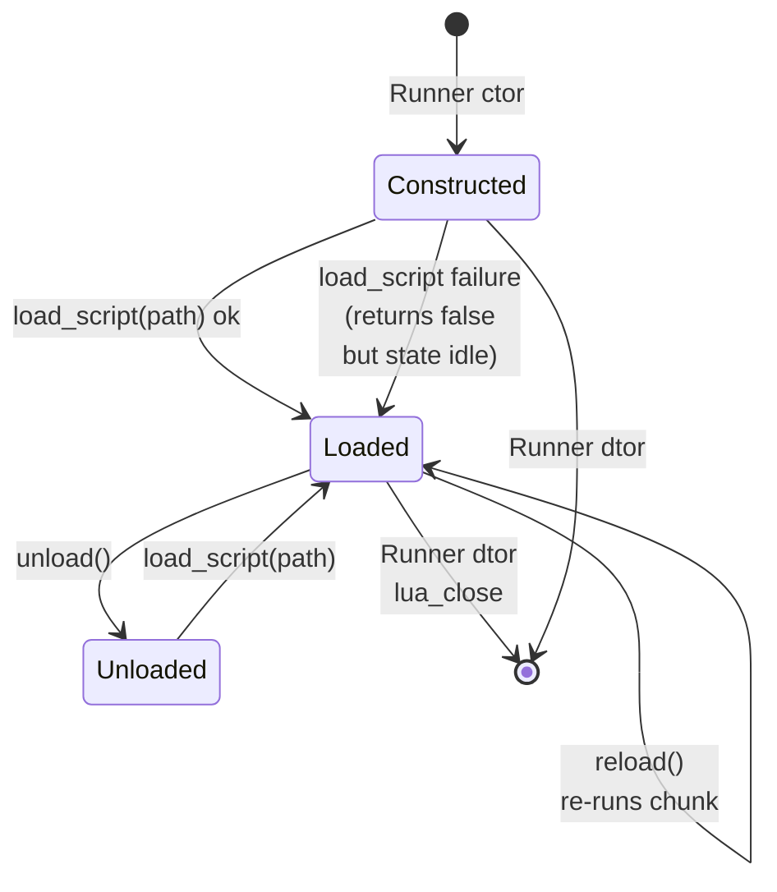
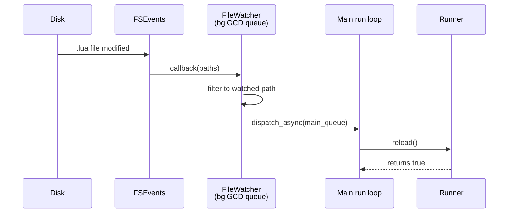

# MEU runner

`aaa::meu::Runner` is the Mac-native MEU (Modular Effect Unit) runtime.
It owns one Lua VM, a shader-program cache, per-frame uniform / texture
binding state, and a mirror of the keyboard / mouse / scroll input
surface.

It is the **superseding equivalent** of the vendor engine's layer
subsystem -- see
`memory/project_layer_supersession.md`.

Source : `src/meu/aaa_meu_runner_mac.{h,mm}`.

---

## Class API

```cpp
namespace aaa::meu {

class Runner {
public:
    explicit Runner( GOL::Backend* backend );
    ~Runner();

    // Lifecycle
    bool load_script( std::string const& lua_path );
    bool reload();
    void unload();

    // Render
    void render_frame( std::uint32_t width, std::uint32_t height,
                       GOL::TextureId target_color_attachment );

    // Input dispatch
    void on_key_event   ( int key_code, bool down );
    void on_mouse_event ( double x, double y, int button, bool down );
    void on_scroll_event( double dx, double dy );

    // State queries
    std::string                current_shader_name() const;
    int                        frame_index()         const;
    std::vector< std::string > list_shaders()        const;
    std::string                get_pending_hud_text() const;

    // Widget integration (c147-A)
    void set_widget_system( aaa::ui::widgets::WidgetSystem* ws );

    // Preset save / load (c149-A v3)
    bool save_preset( std::string const& path ) const;
    bool load_preset( std::string const& path );

    // Drag-drop (c149-A v3)
    bool drop_file( std::string const& path );

    // Hot reload via FSEvents (c149-A v3)
    bool enable_file_watch();
    void disable_file_watch();
    bool is_file_watching() const;

private:
    std::unique_ptr< RunnerImpl > _impl;   // pimpl
};

} // namespace aaa::meu
```

---

## Lua VM lifecycle



Key invariants :

- The Lua VM is created **lazily** on the first successful
  `load_script` -- the constructor is cheap.
- `reload()` does **NOT** tear down the `lua_State` ; it re-reads the
  current file + re-runs it as a fresh chunk. Globals from previous
  runs persist (Lua's idempotent re-registration).
- The destructor is idempotent : safe even if `load_script` was never
  called.
- A failed `pcall` of `aaa.on_frame` is **logged but not fatal** ; the
  next frame still calls `aaa.on_frame`. This lets a designer fix a
  typo + hot-reload without restarting the app.

---

## Pimpl + hermetic doctrine

The Runner is a textbook
[hermetic Mac sub-lib](memory-doctrine.md#hermetic-mac-sub-libs) :

- Header has **no** ObjC types, **no** `aaa_mem.h`, **no** `aaa_str.h`.
- All state lives in `RunnerImpl` (pimpl). Only the `unique_ptr<>` is
  visible across the header boundary.
- Implementation file is `aaa_meu_runner_mac.mm` (Objective-C++) and
  imports MetalKit + Foundation freely, but uses **only** :
  - `std::string` / `std::vector` / `std::unordered_map` from STL.
  - The bundled Lua 5.1 C API.
  - `GOL::Backend` from the Metal backend lib.
- **NO** link dependency on `aaaseed_code_utils`, the blocked
  `aaa_mem` / `c_cpu` cone. This is what makes the Runner buildable
  while the rest of the vendor engine is still being ported.

The Runner takes a `GOL::Backend*` (non-owning) in its constructor.
The Backend must outlive the Runner -- in the .app, both are owned by
`AAASeedMTKView` so the lifetime is implicit.

---

## Lua bindings

The Runner exposes its functionality to Lua via the `aaa.*` global
table. Bindings are registered with **raw** `lua_pushcfunction` per
c124-A precedent -- **NOT** the engine's `AAALUACALL` macros, which
would pull in `aaalua`'s reflection chain.

Sample binding wiring (from `aaa_meu_runner_mac.mm`) :

```cpp
static int lua_use_shader( lua_State* L ) {
    auto* self = static_cast< RunnerImpl* >( lua_touserdata( L, lua_upvalueindex( 1 ) ) );
    char const* name = luaL_checkstring( L, 1 );
    self->current_shader_name = name;
    self->use_shader( name );
    return 0;
}

static void register_aaa_bindings( lua_State* L, RunnerImpl* self ) {
    lua_newtable( L );                                  // aaa
    lua_pushlightuserdata( L, self );
    lua_pushcclosure( L, lua_use_shader, 1 );
    lua_setfield( L, -2, "use_shader" );
    // ... 100+ more bindings ...
    lua_setglobal( L, "aaa" );
}
```

The full binding surface is grouped under `aaa.*`, `aaa.ui.*`,
`aaa.io.*`, and `aaa.ime.*` -- documented in the designer
[Lua API reference](../designer/lua-api/core.md).

---

## Hot reload via FSEvents

`Runner::enable_file_watch()` opts in to FSEvents-driven hot reload of
the loaded `.lua` file (c149-A). The watcher is implemented in
`src/meu/aaa_file_watcher_mac.{h,mm}` as a tiny ObjC++ wrapper around
`FSEventStreamCreate` + a GCD dispatch queue.



The dispatch hop to the main queue is **mandatory** -- `Runner::reload()`
touches the `lua_State` + the Metal backend, neither of which are
thread-safe. Honors the `AAA_DISABLE_FILE_WATCH` env var so a CI
environment with flaky FS notifications can opt out.

`Runner::is_file_watching()` is the testable state seam. The integration
test fakes a file mtime bump + asserts `frame_index()` resets to 0 +
`current_shader_name()` returns the new value.

---

## Preset save / load (v3)

`Runner::save_preset(path)` walks the `WidgetSystem`'s retained state +
writes a Lua table file at `path` with the canonical shape :

```lua
return {
  slider_state         = { ["brightness"] = 0.5, ... },
  hsv_picker_state     = { ["main_color"] = {r=0.8,g=0.4,b=0.1,a=1.0}, ... },
  color_well_state     = { ["accent"]     = 3, ... },
  text_input_state     = { ["title"]      = "hello", ... },
  panel_expanded_state = { ["FX panel"]   = true, ... },
}
```

The Runner has **no a priori knowledge** of widget labels ; the Lua
bindings track every label passed through `aaa.ui.*` during the
current run + serialize THAT set. Labels never asked by the script are
not serialized.

`load_preset(path)` is the inverse -- `luaL_dofile` + read each field
into the widget state maps via `WidgetSystem::set_*`. Returns false if
the widget system isn't installed, the file is missing or malformed,
or the returned value isn't a table.

---

## Drag-drop (v3, c149-A Feature 1)

`Runner::drop_file(path)` is the synthetic + real entry point for
drag-drop into the .app :

- Real path : `AAASeedMTKView`'s `NSDraggingDestination`
  `performDragOperation:` extracts the dropped file's URL + calls
  `drop_file(path.UTF8String)`.
- Synthetic path : the Lua binding `aaa.io.drop_file(path)` (a test
  seam) calls into the same entry point.

Both paths route only `.lua` extensions into `load_script(path)`. Other
extensions are ignored (returns false). Empty paths are also rejected.

This is the v3 mechanism that lets a designer drop a fresh MEU onto a
running .app without ever touching the Finder Open dialog.

---

## Cross-references

- [Architecture](architecture.md)
- [Widget system](widget-system.md)
- [NSTextInputClient + IME](nstextinputclient.md)
- [Path A catalog](path-a-catalog.md)
- [Memory doctrine index](memory-doctrine.md)
- Layer supersession
- [Authoring MEUs (legacy guide)](../AUTHORING_MEUS_ON_MAC.md)
