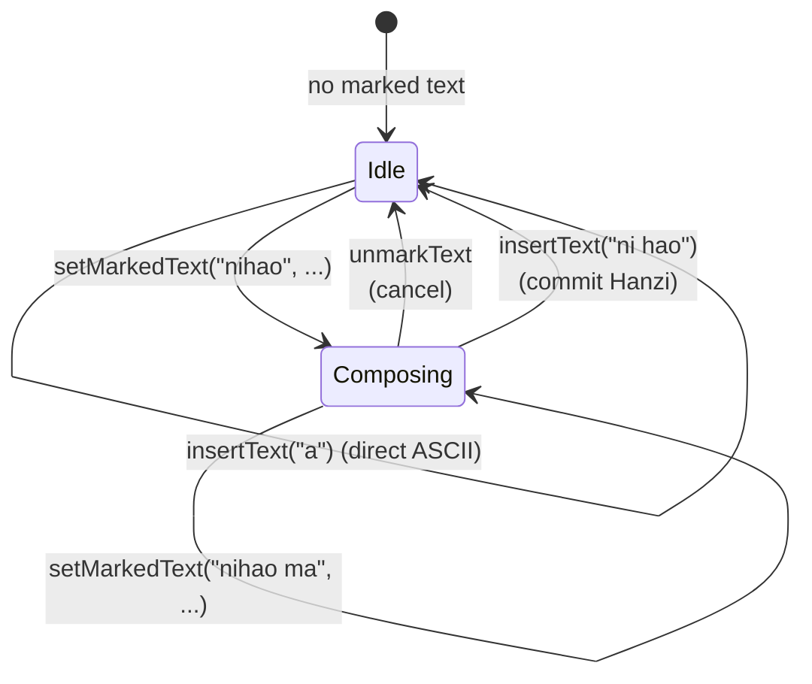
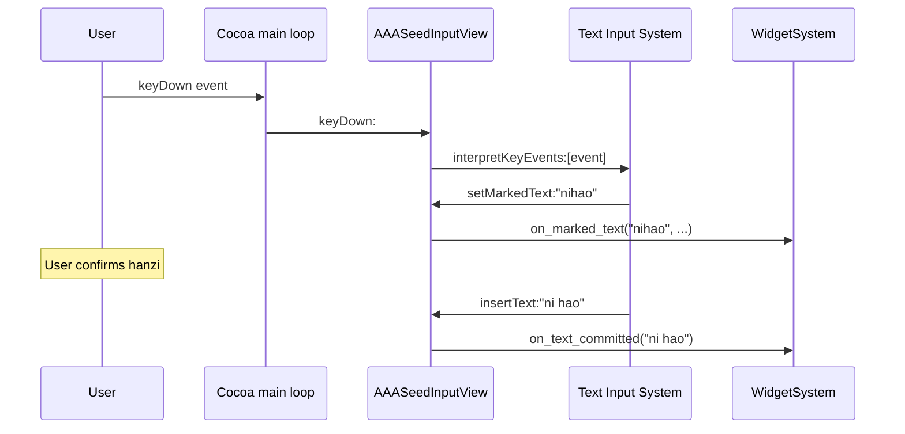

# NSTextInputClient + IME

v4 (c150-A) adds Mac-native **IME** (Input Method Editor) and
multi-line text surface. `AAASeedInputView` conforms to the
`NSTextInputClient` protocol so the macOS Text Input System routes
composition + commit events through the view into the widget system's
`text_input` + `text_area` widgets.

Source : `src/ui/macos/AAASeedInputView.{h,mm}` + the widget-side
methods on `aaa::ui::widgets::WidgetSystem`.

---

## What v4 adds

| Before v4                                                       | After v4                                                       |
| --------------------------------------------------------------- | -------------------------------------------------------------- |
| Single-line `text_input` only                                   | Multi-line `text_area` with word wrap + IME                    |
| ASCII keystrokes via `keyDown:` -> direct codepoint dispatch    | Full Text Input System via `interpretKeyEvents:`               |
| No marked-text (composition) preview                            | Marked-text drawn with composition underline                   |
| CJK input not possible                                          | Apple IME chain (when interactive)                             |

For the protocol-level Apple docs see :
[`NSTextInputClient`](https://developer.apple.com/documentation/appkit/nstextinputclient).

---

## Protocol methods implemented

`AAASeedInputView` declares conformance via :

```objc
@interface AAASeedInputView : MTKView< NSTextInputClient >
```

The `.mm` implements at least **10** protocol methods :

| Method                                                          | What it does                                                          |
| --------------------------------------------------------------- | --------------------------------------------------------------------- |
| `insertText:replacementRange:`                                  | Final commit -> `WidgetSystem::on_text_committed`                     |
| `setMarkedText:selectedRange:replacementRange:`                 | Composition preview -> `WidgetSystem::on_marked_text`                 |
| `unmarkText`                                                    | Cancel composition without commit                                     |
| `hasMarkedText`                                                 | Returns `WidgetSystem::has_marked_text()`                             |
| `markedRange`                                                   | Returns the marked-text NSRange in the focused widget                 |
| `selectedRange`                                                 | Returns the focused widget's selection NSRange                        |
| `attributedSubstringForProposedRange:actualRange:`              | Returns the focused widget's text in the requested range (IME query) |
| `validAttributesForMarkedText`                                  | Returns the styling attribute names we support (underline)            |
| `firstRectForCharacterRange:actualRange:`                       | Screen-space rect for the marked text -> positions the IME candidate window |
| `characterIndexForPoint:`                                       | Reverse hit-test from a screen point to a character offset           |
| `doCommandBySelector:`                                          | Routes special keys (`deleteBackward:`, `insertNewline:`, `cancelOperation:`) |

That's 11 methods. The macOS Text Input System invokes these as it
processes each `keyDown:` ; the view forwards interpretation via
`[self interpretKeyEvents:@[event]]` whenever any text widget has
focus.

---

## Composition state machine



State lives on `WidgetSystemImpl` :

- `_marked_text` (`std::string`, UTF-8)
- `_marked_selection_start` (`int`, char offset)
- `_marked_selection_length` (`int`, char offset)

The renderer draws marked text **underneath** the focused widget's
buffer with a 1-pixel underline (the `validAttributesForMarkedText`
honored attribute). On commit, the marked-text buffer is flushed into
the focused widget at cursor position + the marked state clears.

---

## Synthetic vs real keyboard paths

v4 deliberately keeps **two parallel paths** into the same composition
state :

### Synthetic Lua test seam

Used by **integration + regression tests**. The Lua API exposes :

```lua
-- Set marked text (preview a composition)
aaa.ime.set_marked_text("nihao", 0, 5)

-- Commit it (flush into focused widget)
aaa.ime.commit_text("ni hao")

-- Cancel composition
aaa.ime.unmark()

-- Query (for tests)
local s, start, len = aaa.ime.marked_text()
```

These bindings call directly into `WidgetSystem::on_marked_text` /
`on_text_committed`. They do **NOT** go through the macOS Text Input
System -- they're a fast, deterministic path tests can drive in CI
without a real IME installed.

### Real keyboard path (interactive only)

When a user types in an interactive session :



This path requires a real IME (e.g. macOS Pinyin) to be installed +
selected from the system Input menu.

---

## Honest gap : real CJK keyboard input

**Real CJK keyboard input is NOT autonomously verifiable** in our
test suite. The Apple Text Input System runs out-of-process
(`distnoted` + `IMKLaunch` + the chosen IME's `.app` extension) and
cannot be driven from a unit test without :

- A real user logged into a graphical macOS session.
- Their preferred IME installed (e.g. Pinyin, Kotoeri, Hangul).
- Manual key sequence -> marked text -> commit.

What we **DO** verify autonomously :

| Property                                                                 | Test location                                            |
| ------------------------------------------------------------------------ | -------------------------------------------------------- |
| Synthetic `set_marked_text` updates `current_marked_text()`              | `tests/unit/widgets_ime_test.cpp`                        |
| Synthetic `commit_text` flushes into the focused widget                  | `tests/unit/widgets_ime_test.cpp`                        |
| Synthetic `unmark` clears marked state without modifying buffer          | `tests/unit/widgets_ime_test.cpp`                        |
| `text_area` word-wrap respects `width_chars`                             | `tests/unit/widgets_text_area_test.cpp`                  |
| `text_area` cursor advances correctly through newlines                   | `tests/unit/widgets_text_area_test.cpp`                  |
| `focused_text_area_id()` non-zero -> IME gate opens in `InputView`       | `tests/integration/input_view_ime_gate_test.mm`          |
| All 11 NSTextInputClient methods are declared in the `.mm`               | `tests/regression/nstextinputclient_methods_test.cpp`    |

The boundary is honest : we verify the **widget side** of the IME
state machine + the **declaration** of the protocol methods. We do
NOT claim coverage of Apple's IME chain itself.

---

## Closure references

- **Project closure** : [`memory/project_v4_milestone.md`](../../memory/project_v4_milestone.md)
  (v4 STATUS : CLOSED footer, 2026-05-27).
- v1 ship gate "PROJECT CLOSURE" section :
  [`memory/project_v1_ship_gate.md`](../../memory/project_v1_ship_gate.md).
- User mandate : "no more versions after v4" -- the Mac port is
  feature-complete. Future work (new shaders, sample MEUs, bug fixes)
  is **maintenance**, not new versions.

---

## Cross-references

- [Architecture](architecture.md)
- [Widget system](widget-system.md)
- [MEU runner](meu-runner.md)
- [Memory doctrine index](memory-doctrine.md)
- [v4 milestone closure](../../memory/project_v4_milestone.md)
- [Authoring MEUs (legacy guide)](../AUTHORING_MEUS_ON_MAC.md)
