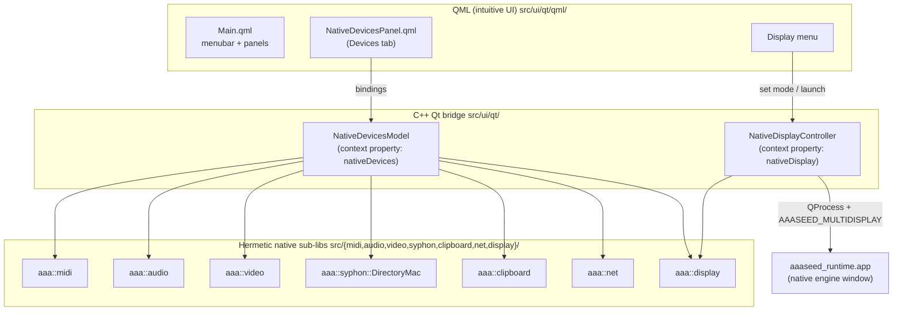
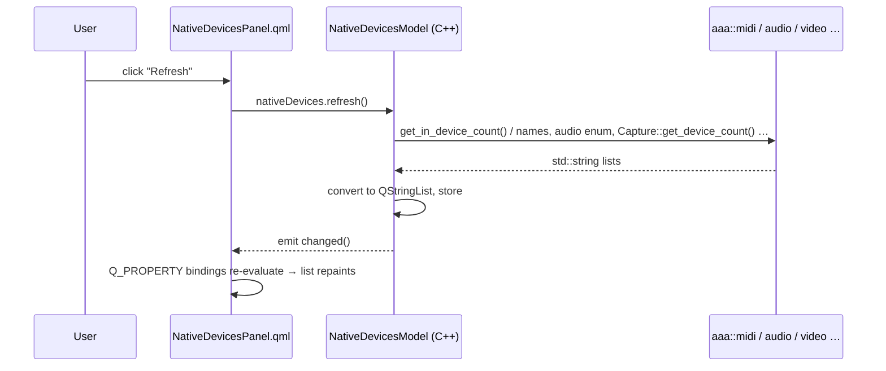
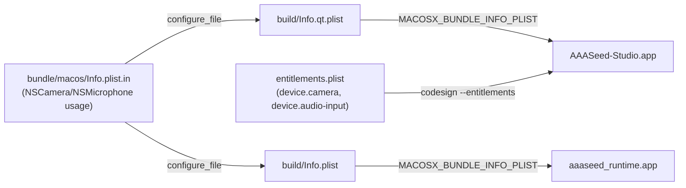

# Qt ↔ native-feature integration (c154)

How the c153 native feature sub-libs (`aaaseed_midi`, `aaaseed_audio`, `aaaseed_video`,
`aaaseed_syphon`, `aaaseed_clipboard`, `aaaseed_net`, `aaaseed_display`) reach the Qt6 + QML
Studio, how the **Display** menu switches the engine output surface, how camera/mic permissions
flow, and how to debug or extend any of it.

The guiding rule of this integration: **additive, never destructive**. The intuitive QML Studio
UI and the 54 pre-existing Qt::Test cases are untouched; everything new sits alongside.

---

## 1. The three layers and who owns what



- **QML** never talks to a native sub-lib directly. It only binds to the two **context
  properties** registered in `aaa_qt_main.cpp`: `nativeDevices` and `nativeDisplay`.
- **The bridge** (`src/ui/qt/aaa_native_bridge.{h,cpp}`) is plain C++. Every native header it
  includes is C++-clean (PIMPL / `std::` types), so no Objective-C leaks into the Qt TU — the
  `.mm` lives inside each sub-lib. This is why the bridge compiles as ordinary C++ next to the
  other panel adapters.
- **The native sub-libs** are the hermetic, unit-tested c153 deliverables. They are the single
  source of device truth shared by the Studio UI and the engine.

### Why two objects, not one
`NativeDevicesModel` is *read-mostly enumeration* (what MIDI/audio/video/Syphon/displays exist +
clipboard + async HTTP). `NativeDisplayController` is *stateful control* (which engine output
surface is active, multi-display span on/off, launching the native window). Keeping them separate
mirrors the existing `sound`/`camera`/`tasks` split and keeps each testable in isolation.

---

## 2. Data flow: a device list reaching the screen



Key points for debugging:

- Enumeration is **TCC-safe**: `refresh()` only *lists* devices. It never opens the camera or mic,
  so it never triggers a permission prompt. (Live capture — opening a device — is what prompts;
  that path lives in the Qt-Multimedia Camera panel and in the engine.)
- `refresh()` calls `refreshSyphon()` which `poll()`s the Distributed-Notification bus; if a Syphon
  server isn't listed, it simply hasn't advertised a frame yet — click **Poll** again.
- All bridge log lines route to the Studio **Console** (`logLine` → `StudioModel::logLine`), so the
  first place to look when a device is missing is the Console panel.

---

## 3. The Display menu — engine output surface

The **Display** menu (top menubar, between Run and View) chooses *where engine frames appear*:

| Choice | Effect | Backed by |
|---|---|---|
| **Intuitive Preview (in Studio)** | engine renders into the embedded Qt Engine Preview panel (default) | `nativeDisplay.engineDisplayMode = "intuitive"` |
| **Native macOS Window** | launches `aaaseed_runtime.app` as a standalone native window — the path that carries the c153 multi-display span + zero-copy video | `nativeDisplay.launchNativeDisplay()` |
| **Multi-display span (Native)** | when launching native, sets `AAASEED_MULTIDISPLAY=1` so the runtime mirrors each aux display's sub-rect | `nativeDisplay.multiDisplaySpan` |

```mermaid
sequenceDiagram
    participant U as User
    participant D as Display menu
    participant C as NativeDisplayController
    participant Q as QProcess
    participant R as aaaseed_runtime.app
    U->>D: "Native macOS Window"
    D->>C: setEngineDisplayMode("native"); launchNativeDisplay()
    C->>C: locateRuntimeApp() (bundle Resources/runtime, dev sibling, …)
    C->>Q: startDetached(exe, env={AAASEED_MULTIDISPLAY if span})
    Q->>R: spawn → native MTKView window (AAASeedMTKView)
    R-->>U: native engine output (+ aux windows if span)
```

- The choice **persists** via `QSettings` group `display` (`engineDisplayMode`,
  `multiDisplaySpan`), so it survives relaunch.
- `launchNativeDisplay()` **fails gracefully**: if it can't locate `aaaseed_runtime` (e.g. a dev
  build where the runtime target wasn't built), it logs to the Console and returns `false` — no
  crash. Build the `aaaseed_runtime` target, or run from a packaged DMG (where the runtime is
  bundled at `Contents/Resources/runtime/` by `scripts/ship-qt-dmg.sh`).
- The native window's multi-display behaviour is the c153 `AAASeedMTKView` path: it reads
  `AAASEED_MULTIDISPLAY` at first frame and, with ≥2 screens, mirrors each aux display's
  `normalized_subrect` via `SubRectPresenter`. See `docs/developer/native-subsystems.md` §
  Multi-display.

---

## 4. Camera / microphone permissions (the DMG fix)

macOS TCC requires an app's `Info.plist` to declare `NSCameraUsageDescription` /
`NSMicrophoneUsageDescription` **before** it touches the camera/mic — otherwise the OS *kills* the
process and never prompts.

Before c154 the shipping Studio app (`aaaseed_app_qt`) **auto-generated** its `Info.plist` from
CMake target properties, which omit those keys — yet the Studio's Camera panel opens the camera via
Qt Multimedia. Latent crash.

The fix (in `src/ui/qt/CMakeLists.txt`): the Studio now `configure_file`s the canonical
`bundle/macos/Info.plist.in` (the same template the native runtime already used) into
`Info.qt.plist` and points `MACOSX_BUNDLE_INFO_PLIST` at it. That template carries both usage
strings. Entitlements (`bundle/macos/entitlements.plist`, applied by `ship-qt-dmg.sh`'s `codesign
--entitlements`) already grant `com.apple.security.device.camera` /
`...audio-input`.



**Verify on a built bundle:**
```bash
/usr/libexec/PlistBuddy -c "Print :NSCameraUsageDescription" \
  out/macos-arm64-debug/bin/AAASeed-Studio.app/Contents/Info.plist
```
The regression test `aaa_qt_integration_regression_test` asserts the template keeps both keys and
that the CMake keeps wiring `MACOSX_BUNDLE_INFO_PLIST` — so this can't silently regress.

---

## 5. Tests (where each guarantee lives)

| Test | Kind | Guards |
|---|---|---|
| `aaa_qt_native_bridge_test` | unit (guiless) | bridge enumerates without crashing; Display mode/span set + persist; clipboard round-trip; native-launch is graceful |
| `aaa_qt_native_panel_qml_test` | integration (offscreen QML) | `NativeDevicesPanel.qml` instantiates to Ready with `nativeDevices`/`nativeDisplay` bound — the feature *appears* |
| `aaa_qt_integration_regression_test` | regression (file-content) | Info.plist keeps camera/mic keys; entitlements grant device access; CMake wires the plist; Main.qml keeps the Display menu + Devices tab; `.qrc` lists the panel; `main.cpp` registers the context properties |

Run just the Qt integration cohort:
```bash
ctest --preset macos-arm64-debug -L qt --output-on-failure
```

---

## 6. How to extend or customise

### Add a row/section to the Devices panel
1. Add a getter + `Q_PROPERTY` (and populate it in `refresh()`) to `NativeDevicesModel`.
2. Add a `DeviceSection { heading: …; entries: nativeDevices.yourList }` to
   `NativeDevicesPanel.qml`.
3. Extend `aaa_qt_native_bridge_test` with a `QVERIFY( m.yourList().size() >= 0 )`.

### Surface a brand-new native subsystem
1. Build it as a hermetic sub-lib under `src/<name>/` with a **C++-clean header** (see
   `docs/developer/native-subsystems.md` for the doctrine).
2. Include its header in `aaa_native_bridge.cpp`, call it from `refresh()`.
3. Link the sub-lib in **both** `src/ui/qt/CMakeLists.txt` (the app) and the
   `AAA_NATIVE_FEATURE_LIBS` list in `tests/qt/CMakeLists.txt` (the tests).

### Change what the Display "Native" mode does
`NativeDisplayController::launchNativeDisplay()` is the single seam. It locates the runtime and
spawns it with environment. To pass more flags to the engine, extend the `QProcessEnvironment` or
`proc.setArguments(...)` there — the QML menu doesn't need to change.

### Debugging checklist
- **Device missing in UI?** Check the Console (bridge logs every refresh). Confirm the native
  sub-lib's own unit test passes (`ctest -R aaaseed_<name>`).
- **Native window won't open?** Console shows the searched path; build `aaaseed_runtime` or run
  from the DMG.
- **Camera prompt never appears / app dies on capture?** Re-check the bundle Info.plist (§4).
- **QML binding to `nativeDevices` undefined?** Confirm `aaa_qt_main.cpp` still
  `setContextProperty("nativeDevices", …)` — the regression test catches this.
