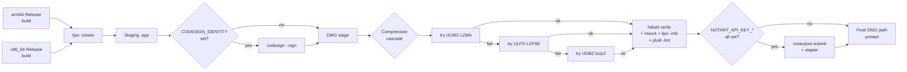

# Ship script

`scripts/ship-dmg.sh` is the **single end-to-end pipeline** that
produces a universal-binary, optionally code-signed + notarized
AAASeed DMG. Produced by continuation c143-B (2026-05-27) per the
user's escalated mandate "ship Apple Silicon AND Intel Macs, using
the best-working compression for portability".

The companion `scripts/verify-dmg.sh` runs the post-receipt structural
verification.

---

## Pipeline overview



---

## Quick reference

```bash
# Full ship (defaults: Release, both arches, no sign, no notarize)
./scripts/ship-dmg.sh

# Single-arch fast iteration
ARCHES="arm64" ./scripts/ship-dmg.sh

# Code-signed
CODESIGN_IDENTITY="Developer ID Application: Acme Inc (TEAMID)" \
  ./scripts/ship-dmg.sh

# Code-signed + notarized
CODESIGN_IDENTITY="Developer ID Application: Acme Inc (TEAMID)" \
NOTARY_API_KEY_PATH=/path/to/AuthKey_XXX.p8 \
NOTARY_API_KEY_ID=XXXXXXXXXX \
NOTARY_API_KEY_ISSUER_ID=00000000-0000-0000-0000-000000000000 \
  ./scripts/ship-dmg.sh
```

Output : `out/AAASeed-<VERSION>.dmg` (where `<VERSION>` is parsed from
the top-level `CMakeLists.txt` `project(... VERSION ...)` declaration).
Default `0.0.1` -> `out/AAASeed-0.0.1.dmg`.

---

## Environment variables

| Variable                   | Default                  | Purpose                                                                                |
| -------------------------- | ------------------------ | -------------------------------------------------------------------------------------- |
| `BUILD_TYPE`               | `Release`                | CMake build type. `Debug` for an unstripped DMG (debugging the ship process).          |
| `ARCHES`                   | `arm64 x86_64`           | Space-separated archs to build + lipo. `ARCHES="arm64"` skips x86_64.                  |
| `BUILD_ROOT`               | `<repo>/out`             | Where per-arch build dirs live.                                                        |
| `PRIMARY_ARCH`             | `arm64`                  | Which arch's `.app` skeleton seeds the universal bundle.                               |
| `CODESIGN_IDENTITY`        | (unset)                  | Developer ID Application string. Absent -> unsigned DMG (Gatekeeper will warn).        |
| `NOTARY_API_KEY_PATH`      | (unset)                  | Absolute path to App Store Connect `.p8` key.                                          |
| `NOTARY_API_KEY_ID`        | (unset)                  | 10-char App Store Connect key ID.                                                      |
| `NOTARY_API_KEY_ISSUER_ID` | (unset)                  | Issuer UUID from App Store Connect. All three notary vars must be set together.        |

**Identities are NEVER hardcoded.** Both code-sign and notary creds are
read verbatim from env so the script can be committed without leaking
secrets. A regression-guard test asserts no signing identity literal
appears in `scripts/ship-dmg.sh`.

---

## Compression cascade

The script tries DMG compression algorithms in best-compression-first
order :

| Algorithm | macOS support  | Size   | Notes                                          |
| --------- | -------------- | ------ | ---------------------------------------------- |
| `ULMO` (LZMA)  | 10.11+    | smallest | Best for SHIPPING (smallest download)        |
| `ULFO` (LZFSE) | 10.11+    | small    | Apple-native ; best for COMPATIBILITY        |
| `UDBZ` (bzip2) | 10.4+     | largest  | Broad legacy fallback                        |

The first compression that succeeds (i.e. `hdiutil create` exits 0 + the
resulting `.dmg` passes `hdiutil verify`) wins. The cascade exists
because `hdiutil` occasionally rejects ULMO on certain notary
combinations -- the fallback path means a ship never fails on
compression alone.

---

## verify-dmg.sh (post-receipt)

`scripts/verify-dmg.sh <path-to-dmg>` runs 12 structural checks with
distinct exit codes :

| Exit code | Check                                                          |
| --------- | -------------------------------------------------------------- |
| `0`       | Success                                                        |
| `64`      | Bad arguments                                                  |
| `65`      | `hdiutil verify` failed (checksum / filesystem)                |
| `66`      | `hdiutil attach` failed                                        |
| `67`      | `AAASeed.app` missing inside DMG                               |
| `68`      | `Applications` symlink missing or wrong target                 |
| `69`      | Executable missing or not executable                           |
| `70`      | Executable is not Mach-O universal                             |
| `71`      | Missing `arm64` or `x86_64` slice                              |
| `72`      | `Info.plist` failed `plutil -lint`                             |
| `73`      | `Resources/meu/hello_world.lua` missing                        |
| `74`      | Shader catalog < 100 `.metal` files                            |
| `75`      | `hdiutil detach` failed (post-success cleanup)                 |

Signature verification (`codesign --verify`, `spctl --assess`) is
**deliberately NOT** part of this script. A regression-guard test
enforces the separation -- see
[Regression guard tests](memory-doctrine.md#regression-guard-tests).

```bash
./scripts/verify-dmg.sh out/AAASeed-0.0.1.dmg
./scripts/verify-dmg.sh --quiet out/AAASeed-0.0.1.dmg
```

---

## Code signing setup

You need an **Apple Developer ID Application** certificate in your
login keychain. To check what you have :

```bash
security find-identity -v -p codesigning
```

The output for a valid identity looks like :

```
1) ABCDEF1234... "Developer ID Application: Acme Inc (TEAMID)"
   1 valid identities found
```

Set the env var verbatim from the quoted string :

```bash
export CODESIGN_IDENTITY="Developer ID Application: Acme Inc (TEAMID)"
```

The signing step uses `--options runtime --timestamp` for hardened
runtime + a secure timestamp ; both are required for notarization to
succeed. Entitlements come from `cmake/codesign_assets/entitlements.plist`.

---

## Notarization setup

You need an App Store Connect API key (NOT an Apple ID password). From
<https://appstoreconnect.apple.com/access/api> :

1. Generate a new key with the **Developer** role.
2. Download the `AuthKey_XXXXXXXXXX.p8` file (one-time only).
3. Note the 10-character Key ID and the Issuer UUID.

Then set the three env vars together :

```bash
export NOTARY_API_KEY_PATH=/secure/path/AuthKey_XXXXXXXXXX.p8
export NOTARY_API_KEY_ID=XXXXXXXXXX
export NOTARY_API_KEY_ISSUER_ID=00000000-0000-0000-0000-000000000000
```

The script uses `xcrun notarytool submit ... --wait` (synchronous) so a
ship run completes only after Apple's notary service has approved or
rejected the submission. On success the script runs
`xcrun stapler staple <dmg>` so the notarization ticket travels with the
DMG even on offline first-run.

---

## Cross-references

- [Architecture](architecture.md)
- [Building from source](building.md)
- [Running tests](testing.md)
- [Memory doctrine index](memory-doctrine.md)
- [`scripts/ship-dmg.sh`](https://github.com/SeedeXR/aaaseed-for-mac/blob/main/scripts/ship-dmg.sh)
- [`scripts/verify-dmg.sh`](https://github.com/SeedeXR/aaaseed-for-mac/blob/main/scripts/verify-dmg.sh)
- [`SHIP_CHECKLIST.md`](https://github.com/SeedeXR/aaaseed-for-mac/blob/main/SHIP_CHECKLIST.md)
