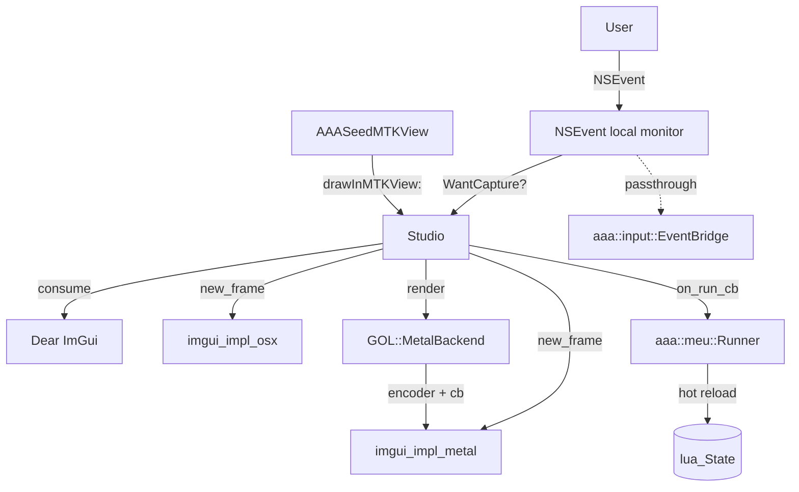

# Studio UI

The Studio is the in-app authoring surface that ships inside `AAASeed.app`.
It is implemented on top of [Dear ImGui](https://github.com/ocornut/imgui)
v1.91 and the project's existing `GOL::MetalBackend`.

## Why Dear ImGui

The original GaBuZoMeu UI on Windows is an immediate-mode framework on top
of OpenGL ; the BU / BUS / MEU / MU stack rebuilds widgets per frame from
script-driven state. Dear ImGui is the closest commodity equivalent in
the Mac/Metal world :

- Immediate mode, no retained-widget tree ; matches the BU cadence.
- Renders inside the same Metal render pass the engine already opens
  ; no second window, no second context.
- Lightweight (single static lib + Metal/Cocoa backends), no
  dependencies outside the SDKs.
- Used by every major game-engine tooling layer (Unity / Unreal /
  Godot) so the patterns are well-understood.
- Pairs with the existing Lua MEU runner ; the Code Editor's Run
  button writes the buffer to a temp .lua and calls
  `aaa::meu::Runner::load_script`.

## Layout

```
+---------------------------------------------------------------------+
|  AAASeed | View | Help                                  [main menu] |
+---------------------------------------------------------------------+
| Node Graph                | Code Editor   | MEU Inspector           |
|  drag nodes + pins        |  multi-line   |  param list of the      |
|  Cmd+click to connect     |  Cmd+R = Run  |  currently selected MEU |
|                           |  reload Lua   |                         |
+---------------------------+---------------+-------------------------+
| Shader Catalog (169)      | Camera        | Sound (CoreAudio)       |
|  filter, click-to-bind    |  pos/look/up  |  list audio devices,    |
|                           |  fov/near/far |  IN / OUT / DUPLEX tags |
+---------------------------+---------------+-------------------------+
| Binary Manager            | Performance   | Preferences             |
|  attached sub-procs       |  FPS gauge    |  font scale, theme      |
+---------------------------------------------------------------------+
| Console                                                              |
|  log levels: INFO / WARN / ERR / LUA ; auto-scroll                  |
+---------------------------------------------------------------------+
```

## Architecture



Key wiring :

- `AAASeedMTKView` owns `std::unique_ptr<aaa::ui::studio::Studio>` ;
  lazy-init on the first `drawInMTKView:` so the device and view are
  ready.
- A local `NSEvent` monitor is installed on init to route events to
  the Studio's `handle_ns_event` before normal dispatch. Returning
  `nil` from the handler suppresses the event from reaching the
  engine input bridge — correct when the user is interacting with an
  ImGui window.
- `Studio::render(encoder, cmd_buffer)` runs **after** the engine
  draw pass and the widget pass, so ImGui chrome paints on top.
  Passing `nullptr` for either arg degrades to `ImGui::EndFrame()`
  (used by headless tests).
- The MEU runner's `on_run_cb` is wired to write the Code Editor
  buffer to `$TMPDIR/aaaseed_studio_run.lua` and call
  `Runner::load_script` ; result logged back to the Studio Console.

## Hermetic sub-lib boundaries

`aaaseed_ui_studio_mac` follows the project's hermetic Mac sub-lib
doctrine :

| Boundary | Rule |
|---|---|
| Public header | Pure C++, no ObjC, no metal-cpp types. `void*` bridge per c134-A. |
| Allocator | STL only (`std::string`, `std::vector`, `std::unordered_map`, `<cstdint>`, `<filesystem>`). No `o_str` / `aaa_mem` / `aaa_str` / `aaaseed_code_utils`. |
| ARC | `aaa_studio_metal.mm` is MRC (matches metal-cpp). The upstream `imgui_impl_metal.mm` + `imgui_impl_osx.mm` compile with ARC (their own retain/release semantics). Boundary is the `__bridge` cast at `ImGui_ImplMetal_Init(device)`. |
| Frameworks | Cocoa, Metal, MetalKit, CoreAudio (Sound panel), GameController (transitive via imgui_impl_osx). |

## Dependency graph

```
aaaseed_app
  └── aaaseed_ui_studio_mac
        ├── aaaseed_imgui_metal_backend
        │     ├── aaaseed_imgui (core)
        │     ├── Metal / MetalKit / QuartzCore / AppKit
        │     └── GameController
        ├── aaaseed_gol_metal
        ├── aaaseed_meu_runner
        ├── Cocoa / Metal / MetalKit
        └── CoreAudio
```

## Test coverage

| Suite | File | Tests | GPU needed |
|---|---|---|---|
| Unit | `tests/unit/aaa_studio_test.cpp` | 27 | No |
| Integration | `tests/integration/studio_in_app_test.mm` | 4 | Yes (real Metal) |
| Regression | `tests/regression/studio_data_model_regression_test.cpp` | 8 | No |

Run only the studio suites :

```bash
cmake --build out/macos-arm64-debug --target aaaseed_studio_tests \
    aaaseed_studio_in_app_tests aaaseed_regression_studio_tests
out/macos-arm64-debug/bin/aaaseed_studio_tests --gtest_filter='Studio*'
```

Note : per the project's
[CTest label first-only doctrine](memory-doctrine.md), the secondary
`studio` label isn't selectable via `ctest -L studio` on the current
toolchain. Use `--gtest_filter` for per-suite runs.

## Open items

The full milestone tracker lives in
[`ui/notes/todo.md`](https://github.com/SeedeXR/aaaseed-for-mac/blob/main/ui/notes/todo.md).
Highlights still open after this session :

- `aaa.studio.*` Lua bindings (`add_node`, `log`, `set_camera`) —
  the header comment advertises them but they are not yet registered.
- Real binary process manager (`NSTask` + stdout drain).
- AVFoundation camera capture into a Studio panel (current Camera
  panel is pose-only).
- Bezier wires + imnodes integration for richer routing.
- Cross-platform split : `aaa_studio.cpp` (data model) + per-platform
  `.mm` / `.cpp` siblings.
