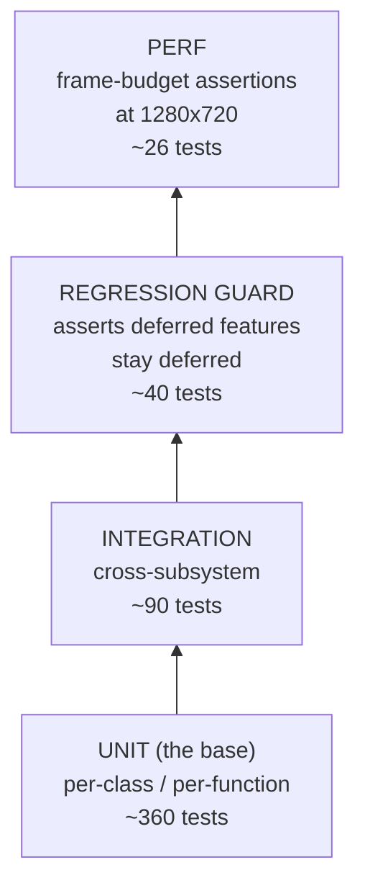

# Running tests

AAASeed for Mac ships with a **516-test** pyramid that runs end-to-end
under `ctest`. Every test is labelled so that you can filter by cohort
(unit / integration / regression / perf) or by feature area (`meu`,
`widgets`, `ui`, `v3`, `v4`, etc).

---

## The test pyramid



| Cohort           | Approx. count | Location                            | Label             |
| ---------------- | ------------- | ----------------------------------- | ----------------- |
| Unit             | ~360          | `tests/unit/`                       | `unit`            |
| Integration      | ~90           | `tests/integration/`                | `integration`     |
| Regression guard | ~40           | `tests/regression/`                 | `regression`      |
| Performance      | ~26           | `tests/unit/` (label-filtered)      | `perf`            |
| **Total**        | **516**       |                                     |                   |

Counts drift slightly between sessions ; the authoritative source is
`ctest -N | tail -1` after a clean build.

---

## ctest labels

CMake's `gtest_discover_tests` runs each test binary at configure time
to register every gtest case. We tag each test with `PROPERTIES LABELS`
to drive filtered runs. Per
[CTest label first-only](memory-doctrine.md#ctest-label-first-only) the
toolchain honors **ONLY** the first label, so the primary filter key
goes first :

```cmake
set_tests_properties(my_perf_test PROPERTIES LABELS "perf;v4;meu")
# ctest -L perf -> selected
# ctest -L meu  -> NOT selected (label honored = "perf" only)
```

Labels in active use :

| Label         | Selects                                                       |
| ------------- | ------------------------------------------------------------- |
| `unit`        | Every gtest under `tests/unit/`                               |
| `integration` | Cross-subsystem (Runner + WidgetSystem + Backend)             |
| `regression`  | Regression-guard tests                                        |
| `perf`        | Frame-budget assertions                                       |
| `phase4`      | Input wiring + event bridges                                  |
| `phase8`      | Ship pipeline (DMG verify, compression cascade)               |
| `meu`         | MEU runner unit tests                                         |
| `widgets`     | WidgetSystem unit tests                                       |
| `ui`          | Mac UI host (`AAASeedMTKView`, `AAASeedInputView`)            |
| `v3`          | v3 feature tests (drag-drop, hot-reload, presets, collapsing) |
| `v4`          | v4 feature tests (NSTextInputClient, text_area, IME)          |

---

## Running tests

```bash
# Build everything first
cmake --build out/macos-arm64-debug -j 8

# All 516 tests
ctest --test-dir out/macos-arm64-debug --output-on-failure

# A single cohort
ctest --test-dir out/macos-arm64-debug -L unit
ctest --test-dir out/macos-arm64-debug -L perf
ctest --test-dir out/macos-arm64-debug -L v4

# A single test by name
ctest --test-dir out/macos-arm64-debug -R "SliderDragsOnHorizontalMouseMove"

# Parallel (default is serial)
ctest --test-dir out/macos-arm64-debug -L unit -j 8
```

Note : if you run with `-j` and see flaky failures, check whether the
test uses distributed notifications. See
[Distnoted dual-center](memory-doctrine.md#distnoted-dual-center).

---

## Performance budgets

Per c121-B + c140-B every revival shader has a paired perf test that
asserts a render-time budget at **1280 x 720**. The budget shape :

```cpp
// tests/unit/perf_aaa_bloom_real_test.cpp (illustrative)
constexpr auto kBudget = std::chrono::microseconds( 2500 );
auto elapsed = render_one_frame_at( 1280, 720 );
EXPECT_LT( elapsed, kBudget );
```

Budgets are deliberately generous (~2.5x measured baseline) so the
tests do not flake on cold-cache or shared-CI hosts. A real regression
will blow past 2.5x and trip the assertion immediately.

The full perf suite runs in under 30 s on an M1 Pro :

```bash
ctest --test-dir out/macos-arm64-debug -L perf --output-on-failure
```

See [Path A catalog](path-a-catalog.md) for the per-revival perf test
mapping.

---

## Regression-guard pattern

Per
[Regression guard tests](memory-doctrine.md#regression-guard-tests)
when a beachhead **defers** a sub-feature (signing, sandbox, network)
for governance reasons, we add a regression-guard test asserting the
deferred symbol does **NOT** appear in source. This prevents silent
creep where a future session "accidentally" lands the deferred feature.

Example shape :

```cpp
// tests/regression/no_codesign_in_ship_dmg_test.cpp
TEST( ShipDmgNoCodesign, ScriptDoesNotForceCodesignIdentity )
{
    auto contents = read_file( "scripts/ship-dmg.sh" );
    // codesign MUST be conditional on env var, never hardcoded
    EXPECT_THAT( contents, Not( HasSubstr( "Developer ID Application: " ) ) );
}
```

Currently ~40 such guards cover : DMG signing config, sandbox
entitlements, network ports, distnoted reverse-route, IME bypass paths.

---

## Interactive gaps (honest documentation)

Three feature areas have inherent gaps in autonomous test coverage
because they require a human at the keyboard / mouse / IME chain :

| Feature                  | Gap                                                        | Mitigation                                          |
| ------------------------ | ---------------------------------------------------------- | --------------------------------------------------- |
| **Drag-drop**            | NSDraggingDestination needs a Finder source                | Synthetic `aaa.io.drop_file(path)` Lua binding      |
| **Space-press for play** | `NSEventTypeKeyDown` needs `interpretKeyEvents:` chain     | Direct `on_key_event(0x31, true)` test seam         |
| **Real CJK IME**         | Real Hanzi / hiragana input needs Apple IME chain          | `aaa.ime.set_marked_text` synthetic Lua binding     |

Each gap is documented in the matching guide
([MEU runner](meu-runner.md) for drag-drop,
[Widget system](widget-system.md) for keyboard,
[NSTextInputClient + IME](nstextinputclient.md) for CJK).

---

## CI tips

- Always pin `CMAKE_BUILD_TYPE=Debug` for CI test runs ; Release LTO
  builds skip some asserts that catch real bugs.
- Run cohorts in parallel groups : `unit` + `integration` together is
  fine ; `perf` should run alone (CPU pinning).
- The `regression` cohort is the cheapest -- run it on every PR.

---

## Cross-references

- [Architecture](architecture.md)
- [Building from source](building.md)
- [Ship script](ship-script.md)
- [Memory doctrine index](memory-doctrine.md)
- [Path A catalog](path-a-catalog.md)
