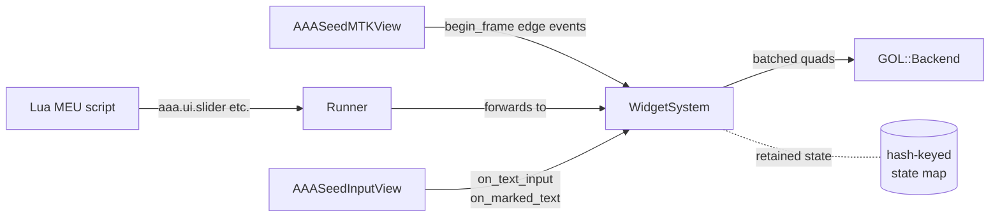
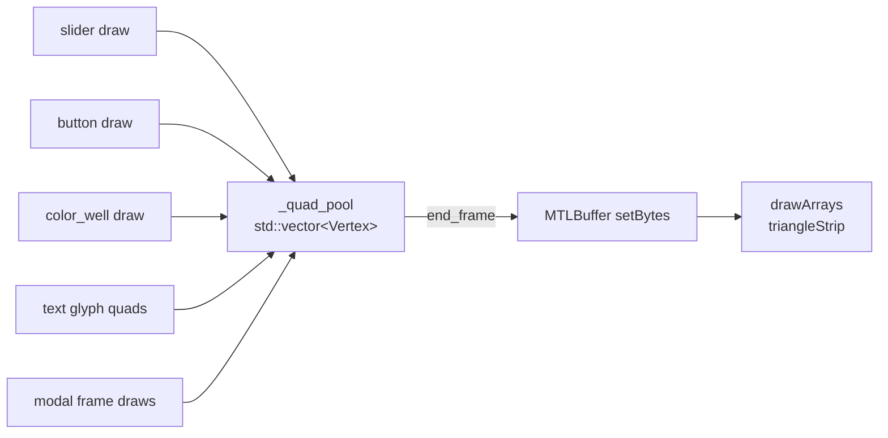

# Widget system

`aaa::ui::widgets::WidgetSystem` is the Mac-native immediate-mode +
retained-state widget UI that renders **inside** the MTKView. It is the
authoring surface for live MEU parameter tweaking, mouse-driven UI,
keyboard text input, IME composition, drag-drop, and hot reload.

Source : `src/ui/widgets/aaa_widgets_mac.{h,mm}`.

---

## Architecture summary



The system is **immediate-mode at the API** : every frame the script
calls e.g. `aaa.ui.slider("brightness", value, 0, 1)` and gets back
the post-interaction value. But the implementation is **retained
under the hood** : each widget is keyed by `hash(label_string)`, and
its drag state / click latch / picker HSV / panel-expanded flag
persists across frames in `std::unordered_map`s on `WidgetSystemImpl`.

---

## Per-frame begin / end

```cpp
ws.begin_frame( drawable_w, drawable_h,
                mouse_x, mouse_y,
                mouse_pressed_now,  // EDGE flag : press this frame
                mouse_released_now  // EDGE flag : release this frame
              );

// ... widget calls during the host's render_frame ...
auto v = ws.slider( "brightness", v_in, 0.0f, 1.0f );

ws.end_frame();   // encodes batched UI quads against the active encoder
```

The host (`AAASeedMTKView`) converts `NSEventTypeLeftMouseDown` /
`...Up` into the edge flags. Held state is tracked internally between
events.

`end_frame()` does **NOT** begin or end the render pass -- the host
keeps that. WidgetSystem only emits draws into the **active** encoder
per [Metal present-per-pass](memory-doctrine.md#metal-present-per-pass).

---

## The 9 widget primitives

| Primitive               | API                                                       | What it does                                                                               |
| ----------------------- | --------------------------------------------------------- | ------------------------------------------------------------------------------------------ |
| `slider`                | `float slider( label, value, min, max )`                  | Horizontal drag thumb -> value in `[min, max]`                                             |
| `button`                | `bool button( label )`                                    | Returns `true` exactly on click+release frame                                              |
| `color_well_preset`     | `Color4f color_well( label, rgba )`                       | Cycles through 8 preset RGBA colors on click                                               |
| `hsv_color_picker`      | `Color4f hsv_color_picker( label, rgba )`                 | 2D SV square + 1D hue bar + alpha strip + RGB readout                                      |
| `modal`                 | `ModalResult begin_modal( title, w, h )` + `end_modal()`  | Centered popup with `ok` / `cancel` edge flags                                             |
| `text_input`            | `std::string text_input( label, value, max_length=64 )`   | Single-line ASCII input, focus-on-click, Enter commits                                     |
| `hot_reload_button`     | `bool hot_reload_button( label="Reload MEU" )`            | Refresh-icon button ; calls `Runner::reload()` via stored callback                         |
| `collapsing_panel`      | `bool begin_collapsing_panel( title, x, y, w, h )` + `end_collapsing_panel()` | Panel + chevron ; toggles expanded/collapsed on click                  |
| `text_area`             | `std::string text_area( label, value, visible_lines, width_chars, max_length )` | Multi-line word-wrapped input with IME support (v4)              |

Each primitive has a matching `aaa.ui.*` Lua binding registered by the
MEU runner.

---

## Hash-keyed retained state

Per-widget state lives in `std::unordered_map<uint32_t, T>` maps keyed
by `hash(label)`. Each frame :

1. `begin_frame()` records pre-frame mouse coords + edge flags.
2. Each widget call looks up its entry in the matching state map
   (creates default-constructed if missing).
3. The widget runs its hit-test + interaction logic, mutating state.
4. The widget queues a draw command + returns its post-interaction value.
5. `end_frame()` emits the queued draws as a **single batched
   `drawArrays` call** -- one vertex buffer for all UI quads in the
   frame.

This means : adding a 100th widget to a panel does not 100x the draw
cost. The batch grows linearly in vertex count but encodes as one
draw call.

---

## Quad batching strategy



`_quad_pool` is a flat `std::vector<Vertex>` reset at `begin_frame()`.
Each widget appends 6 vertices per quad (two triangles).
`end_frame()` calls `MTLRenderCommandEncoder setVertexBytes:length:`
with the entire pool + one `drawArrays:type:vertexStart:vertexCount:`.

Text glyphs use the same pool ; the c87 glyph atlas is a single Metal
texture sampled by UV.

---

## Mouse hit-testing via edge events

The widget system uses **edge-based** mouse tracking : the host
forwards only the press / release **edges**, not the held state. Held
state is reconstructed internally :

```cpp
// inside WidgetSystemImpl::begin_frame
if ( mouse_pressed_now ) {
    _mouse_held = true;
    _press_x = mouse_x; _press_y = mouse_y;
}
if ( mouse_released_now ) {
    _mouse_held = false;
}
// _mouse_held persists across frames between press + release
```

Each widget hit-tests against `(mouse_x, mouse_y)` + the cached
`_mouse_held`. Drag-driven widgets (sliders, HSV picker) update their
state every frame `_mouse_held` is true AND the press started inside
their rect ; click-driven widgets (buttons, color wells) latch on
press + fire on release.

---

## Keyboard text routing

Text widgets (`text_input`, `text_area`) receive keystrokes via
`on_text_input(codepoint)` -- called by the host either from the
synthetic Lua test seam OR from real `NSTextInputClient` protocol
methods :

| Source                              | Path                                             |
| ----------------------------------- | ------------------------------------------------ |
| Real keystroke (ASCII)              | `keyDown:` -> `interpretKeyEvents:` -> `insertText:` -> `WidgetSystem::on_text_input(codepoint)` |
| Real keystroke (special)            | `interpretKeyEvents:` -> `deleteBackward:` / `insertNewline:` / `cancelOperation:` -> `on_text_input(0x08/0x0A/0x1B)` |
| Lua test seam                       | `aaa.ime.send_text("hi")` -> `on_text_input` per character                                       |
| IME composition (v4)                | `setMarkedText:` -> `WidgetSystem::on_marked_text` (preview under composition cursor)            |
| IME commit (v4)                     | `insertText:` -> `WidgetSystem::on_text_committed` (flush composition into focused widget)       |

For the IME composition path (CJK input, dead keys, marked-text
underlining) see [NSTextInputClient + IME](nstextinputclient.md).

---

## `void*` doctrine reference

Per c134-A (referenced in `src/meu/aaa_meu_runner_mac.h` line 24),
when a public header needs to pass an Objective-C pointer across a
C++ boundary, expose it as `void*`. The receiver casts to the real
ObjC type inside `.mm`. This keeps the header buildable from pure
C++ translation units that include neither `<MetalKit/MetalKit.h>` nor
`<Foundation/Foundation.h>`.

`WidgetSystem` itself avoids ObjC types in its header entirely -- it
takes a `GOL::Backend*` (already a C++ type) + uses `std::string` /
`Color4f` POD structs for label + color values. The `void*` doctrine
is documented here for future widget extensions that need NSEvent or
NSDraggingInfo at the API boundary.

---

## Test seams

Each primitive has matching test seams on the WidgetSystem API :

| Production API                            | Test seam                                                  |
| ----------------------------------------- | ---------------------------------------------------------- |
| `slider`                                  | `slider_drag_delta_pixels( label )`                        |
| `button`                                  | `is_button_armed( label )`                                 |
| `hsv_color_picker`                        | `hsv_picker_value( label )`                                |
| `color_well_preset`                       | `color_well_index( label )`                                |
| `modal`                                   | `is_modal_open()`                                          |
| `text_input`                              | `text_input_value( label )` / `focused_text_input_id()`    |
| `collapsing_panel`                        | `is_panel_expanded( title )` / `collapsing_nest_depth()`   |
| `text_area`                               | `text_area_value` / `text_area_visual_row_count` / `text_area_cursor_row` / `text_area_cursor_col` / `text_area_scroll_top` |

Each seam returns retained state from the per-widget map without
driving the GPU. Unit tests in `tests/unit/widgets_*` exercise the
state machine without ever rendering.

---

## Diagnostics

| Method                                  | Returns                                                                              |
| --------------------------------------- | ------------------------------------------------------------------------------------ |
| `last_frame_widget_count()`             | Number of widgets emitted in the most recent `begin_frame .. end_frame` pair         |
| `last_frame_had_interaction()`          | True when any widget reported hover hit-test OR click during the most recent frame   |

These power the HUD overlay ("UI is responsive" indicator) + the
integration tests that assert mouse routing reaches the right widget.

---

## Cross-references

- [Architecture](architecture.md)
- [MEU runner](meu-runner.md)
- [NSTextInputClient + IME](nstextinputclient.md)
- [Memory doctrine index](memory-doctrine.md)
- [Path A catalog](path-a-catalog.md)
- [Authoring MEUs (legacy guide)](../AUTHORING_MEUS_ON_MAC.md)
