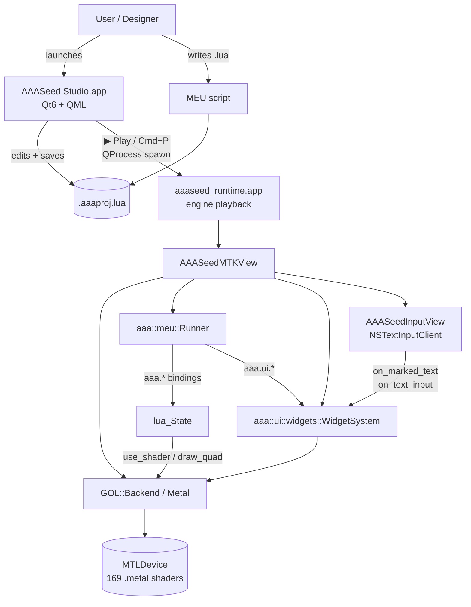

# AAASeed for Mac

A Mac-native port of the **AAASeed** VJ / generative-art engine.

Apple Silicon `arm64`, Metal-rendered, Lua-driven MEU authoring on a
**Qt 6 + QML Studio** with a separate **engine playback runtime**.
Ships as a notarizable `.dmg` produced by a single
`scripts/ship-qt-dmg.sh` run.

[Latest release](https://github.com/SeedeXR/aaaseed-for-mac/releases){ .md-button .md-button--primary }
[GitHub repository](https://github.com/SeedeXR/aaaseed-for-mac){ .md-button }

---

## Quick links

- :material-account-music: **Designer Guide**

    Use AAASeed as a tool. Install the DMG, write MEUs in Lua, browse the
    shader catalog, ship live visuals.

    [Start here](designer/getting-started.md)

- :material-code-tags: **Developer Guide**

    Build from source, run the 54-case Qt::Test suite, ship a fresh
    DMG, extend the Studio / runner / IME subsystems.

    [Architecture](developer/architecture.md) ·
    [Studio UI](developer/studio.md) ·
    [Building](developer/building.md) ·
    [Testing](developer/testing.md)

- :material-book-open-variant: **Authoring guide (legacy)**

    The original c146 - c150 authoring walkthrough, preserved as-is.

    [Open](AUTHORING_MEUS_ON_MAC.md)

- :material-microsoft-windows: **Windows backend runbook**

    Task #152 cross-port notes for the future Win-side implementation.

    [Open](windows-backend-howto.md)

---

## High-level architecture

Studio side is pure Qt6 + QML — no Metal device opened in that
process. Runtime side owns the MTKView and runs the engine loop :

1. `WidgetSystem::begin_frame()` with edge mouse flags.
2. `Runner::render_frame(width, height, target)` → Lua's
   `aaa.on_frame()` → shader selection + uniforms + full-screen quad.
3. `WidgetSystem::end_frame()` emits batched UI quads.
4. HUD overlay text from `Runner::get_pending_hud_text()`.
5. `Backend::present()`.

See [Architecture](developer/architecture.md) for the full breakdown
and [Studio UI](developer/studio.md) for the authoring surface.

---

## Project status

- **54 / 54** Qt::Test cases pass across 4 binaries (studio data
  layer · panel adapters · Lua helper · settings).
- v1 + v2 + v3 + v4 milestones **CLOSED**. No further version bumps
  per user mandate ; future work is maintenance.
- Ships as `out/AAASeed-Studio-0.0.1.dmg` (~52 MB ULMO/LZMA-compressed
  ; macdeployqt bundles QtCore/Gui/Qml/Quick/Multimedia + cocoa
  platform plugin + the nested runtime app). Optional Developer-ID
  code-sign + notarize when env vars are set.
- Source : [github.com/SeedeXR/aaaseed-for-mac](https://github.com/SeedeXR/aaaseed-for-mac).

---

## License

MIT — see [`LICENSE`](https://github.com/SeedeXR/aaaseed-for-mac/blob/main/LICENSE)
in the repository root. Matches upstream AAASeed.

---

## Contributing

Pull requests welcome. See
[`CONTRIBUTING.md`](https://github.com/SeedeXR/aaaseed-for-mac/blob/main/CONTRIBUTING.md)
for the dev setup, code style, and PR flow. Community expectations live
in [`CODE_OF_CONDUCT.md`](https://github.com/SeedeXR/aaaseed-for-mac/blob/main/CODE_OF_CONDUCT.md).
Security vulnerabilities should be reported privately per
[`SECURITY.md`](https://github.com/SeedeXR/aaaseed-for-mac/blob/main/SECURITY.md).

---

## Credits

- **AAASeed** : Mâa Berriet (engine, 1996-present), Franz Hildgen
  (significant contributions), the ArtCast4d.eu European project.
- **Mac port** : Alex Mkwizu (`a.mkwizu@seedexr.com`), with
  AI-assisted research and porting.
