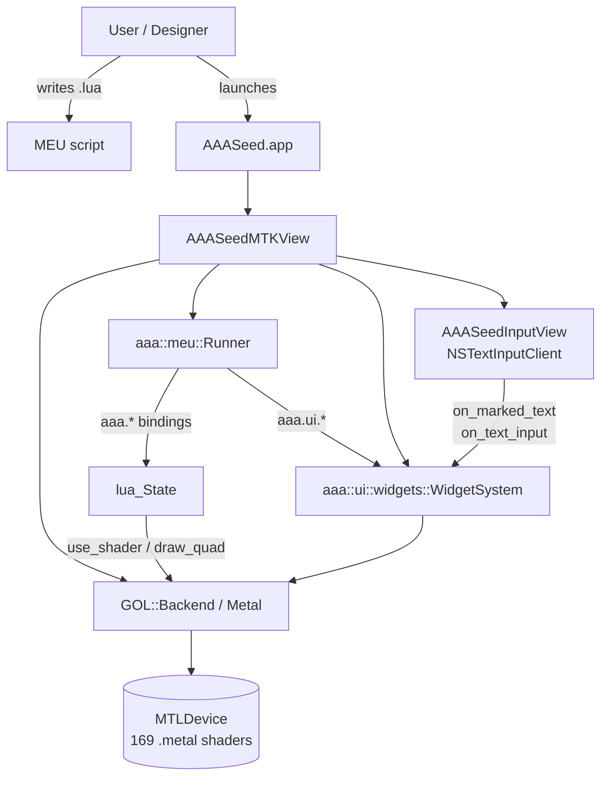

# AAASeed for Mac

A Mac-native port of the **AAASeed** VJ / generative-art engine.

Universal binary (Apple Silicon `arm64` + Intel `x86_64`), Metal-rendered,
Lua-driven MEU (Modular Effect Unit) authoring surface, ships as a
notarizable `.dmg` produced by a single `scripts/ship-dmg.sh` run.

[Latest release](https://github.com/SeedeXR/aaaseed-for-mac/releases){ .md-button .md-button--primary }
[GitHub repository](https://github.com/SeedeXR/aaaseed-for-mac){ .md-button }

---

## Quick links

- :material-account-music: **Designer Guide**

    Use AAASeed as a tool. Install the DMG, write MEUs in Lua, browse the
    shader catalog, ship live visuals.

    [Start here](designer/getting-started.md)

- :material-code-tags: **Developer Guide**

    Build from source, run the 516-test pyramid, ship a fresh DMG, extend
    the runner / widget / IME subsystems.

    [Architecture](developer/architecture.md) -
    [Building](developer/building.md) -
    [Testing](developer/testing.md)

- :material-book-open-variant: **Authoring guide (legacy)**

    The original c146 - c150 authoring walkthrough, preserved as-is.

    [Open](AUTHORING_MEUS_ON_MAC.md)

- :material-microsoft-windows: **Windows backend runbook**

    Task #152 cross-port notes for the future Win-side implementation.

    [Open](windows-backend-howto.md)

---

## High-level architecture

The render loop runs on the main thread inside `drawInMTKView:`. Per
frame the view :

1. Calls `WidgetSystem::begin_frame()` with edge mouse flags.
2. Calls `Runner::render_frame(width, height, target)` -> Lua's
   `aaa.on_frame()` -> shader selection + uniforms + full-screen quad.
3. Calls `WidgetSystem::end_frame()` to emit batched UI quads.
4. Renders the HUD overlay text from `Runner::get_pending_hud_text()`.
5. Presents the drawable via `Backend::present()`.

See [Architecture](developer/architecture.md) for the full breakdown.

---

## Project status

- **516 / 516** tests pass.
- v1 + v2 + v3 + v4 milestones **CLOSED**. No further version bumps per
  user mandate ; future work is maintenance (new MEU shaders, new sample
  scripts, bug fixes).
- Ships as `out/AAASeed-0.0.1.dmg` (~685 KB, universal binary, optional
  Developer ID code-sign + notarize).
- Source : [github.com/SeedeXR/aaaseed-for-mac](https://github.com/SeedeXR/aaaseed-for-mac).

---

## License

See [`LICENSE`](https://github.com/SeedeXR/aaaseed-for-mac/blob/main/LICENSE)
in the repository root.
